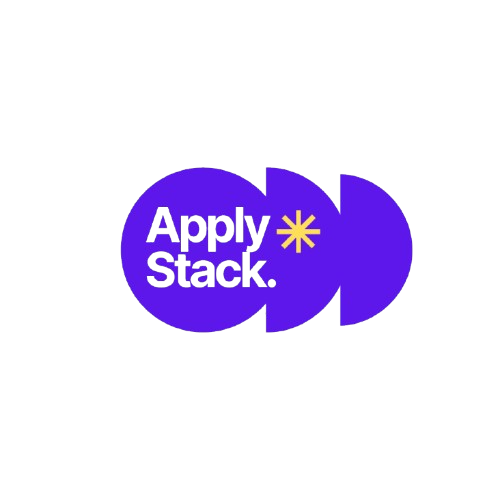

<p align="center">
  <a href="https://github.com/ArshTiwari2004/applystack-microservices/stargazers">
    
  </a>
  <a href="https://github.com/ArshTiwari2004/applystack-microservices/network/members">
    
  </a>
  <a href="https://github.com/ArshTiwari2004/applystack-microservices/issues">
    
  </a>
  <a href="https://github.com/ArshTiwari2004/applystack-microservices/releases">
    
  </a>
</p>


<p align="center">
  
</p>


<h1 align="center">ApplyStack</h1>
<p align="center">
 One stop job application tracking system!
</p>


<p align="center">
  <a href="https://nodejs.org">
    
  </a>
  <a href="https://reactjs.org">
    
  </a>
  <a href="https://mongodb.com">
    
  </a>
  <a href="https://redis.io">
    
  </a>
  <a href="https://docker.com">
    
  </a>
</p>

ApplyStack is a full-stack job application tracking platform built to eliminate the chaos of managing job searches across spreadsheets, sticky notes, and browser tabs.


## Features

### Core Features

✓ **Auth (JWT)** : Secure login, register, forgot/reset password via OTP email  
✓ **Job Tracker** : Track company, role, date, referral, shortlist, interview, offer  
✓ **Company View** : Group applications by company with card/table views  
✓ **Task Manager** : Daily tasks with priority, tags, date grouping (overdue/today/upcoming)  
✓ **Templates** : Save reusable cold messages and application content  
✓ **PDF Export** : Export all applications as a formatted PDF report  
✓ **Smart Filters** : Filter by status: applied, shortlisted, interviewing, offer, not selected  
✓ **Reminders** : Auto-reminder banner for applications not yet submitted  
✓ **Company Logos** : Auto-fetch company logos via Clearbit CDN  


### Infrastructure Features

✓ **Redis Caching** : Jobs cached per-user (5 min TTL), company search cached (1 hr TTL)  
✓ **RabbitMQ** : Async email delivery and background task queue  
✓ **Docker Compose** : 4-service containerized setup (API, MongoDB, Redis, RabbitMQ)  
✓ **Graceful Shutdown** : SIGINT/SIGTERM handlers close all connections cleanly  
✓ **Health Checks** : `/api/health` endpoint verifying all 3 services  


## Installation
 
### Prerequisites
- Node.js 20+
- Docker & Docker Compose
- MongoDB (local or Atlas)
 
### Option 1: Docker Compose (Recommended)
 
```bash
git clone https://github.com/ArshTiwari2004/applystack-microservices.git 
cd applystack
 
# Set environment variables
cp backend/.env.example backend/.env
# Edit backend/.env with your values
 
docker-compose up --build
```
 
Services start at:
- API: `http://localhost:8001`
- RabbitMQ Management: `http://localhost:15672`
 
### Option 2: Manual Setup
 
```bash
# Backend
cd backend
npm install
cp .env.example .env
# Configure .env
node server.js
 
# Frontend
cd frontend
npm install
cp .env.example .env.local
# Set VITE_API_URL=http://localhost:8001
npm run dev
```
 
### Environment Variables
 
**Backend `.env`**
```env
PORT=8001
MONGO_URL=mongodb://localhost:27017
DB_NAME=applystack
JWT_SECRET=your-secure-secret-key
REDIS_URL=redis://localhost:6379
RABBITMQ_URL=amqp://localhost:5672
EMAIL_USER=your@gmail.com
EMAIL_PASS=your-app-password
CORS_ORIGINS=http://localhost:5173
NODE_ENV=development
```
 
**Frontend `.env.local`**
```env
VITE_API_URL=http://localhost:8001
```

## Planned Features
 
- [ ] AI-powered cover letter generator (via Claude API)
- [ ] Interview preparation mode (per company)
- [ ] Google Calendar integration for interview scheduling
- [ ] Analytics dashboard (applications over time, funnel metrics)
- [ ] Chrome extension for one-click job capture from LinkedIn
- [ ] Email parsing to auto-import application confirmations
 

<a href="https://applystack.vercel.app/">

</a>
